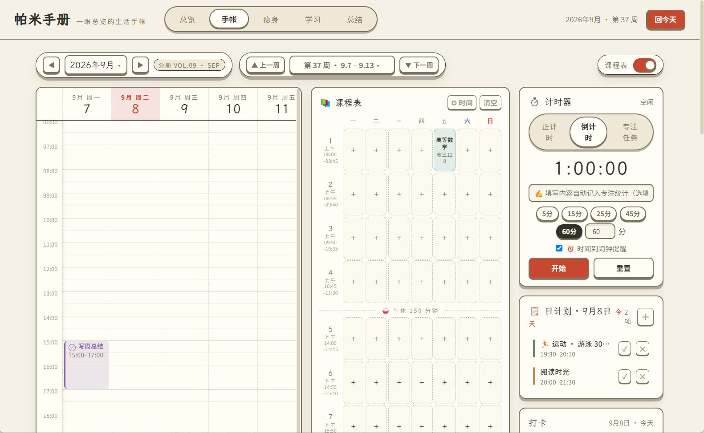
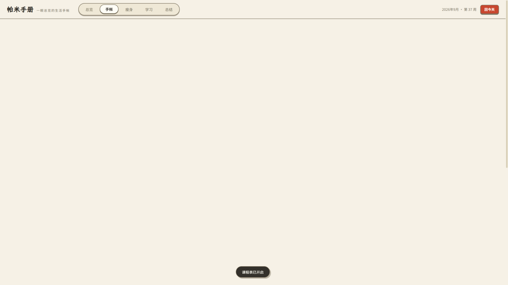
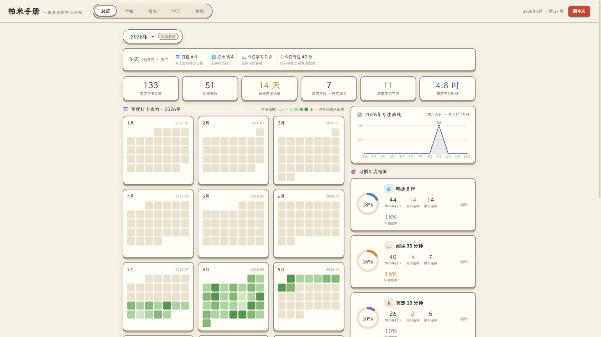
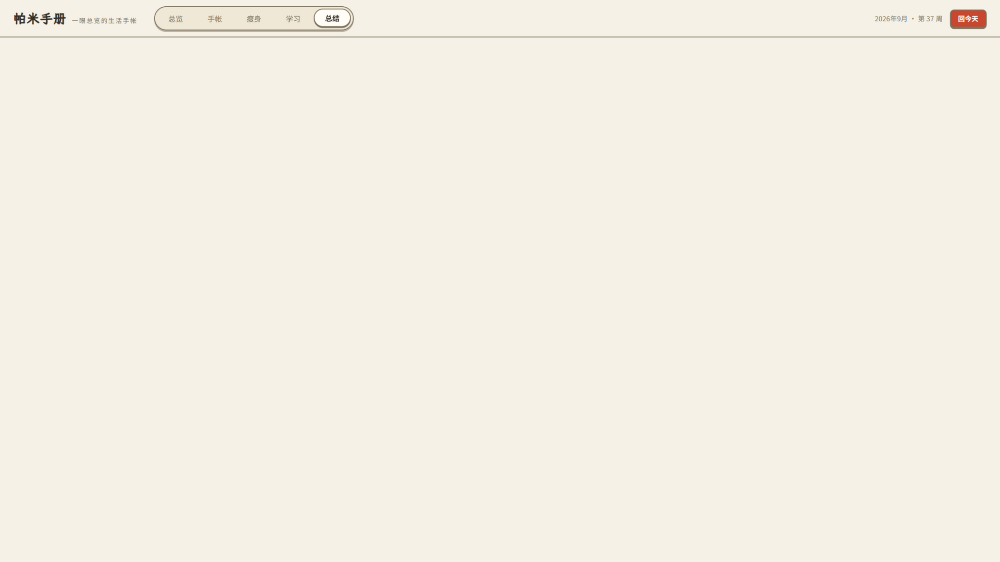

# 帕米手册 📕

> 一眼总览的生活手帐 —— 把日程、打卡、瘦身、学习、项目装进一个界面。
> 灵感源自日本"Pat-mi"手帐的月周联动设计：打开就能看全，点一下就能管细。

## 📥 下载安装（在「安装包」文件夹里）

| 文件 | 平台 | 安装方法 |
|---|---|---|
| `帕米手册-桌面版.zip` | **Windows** 10/11 | 下载后解压到任意目录，双击 `Pat-mi.exe` 运行，免安装绿色版 |

当前版本：v1.2.37 ｜ 无广告、无注册、无需登录，装完即用。
手机版（Android）后续将通过应用商店发布。

## 🖼️ 界面预览

  
  
   
  
  

---

## ✨ 功能介绍

### 📅 手帐 · 日程管理
- **月历与周时间轴联动**：上方月历总览，点击任意日期，自动跳转定位到该日的周时间轴（6:00–24:00），高亮闪烁提示
- **日计划 + 周计划展览**：所选日期和本周的全部日程以清单形式展示，添加、编辑、删除、勾选完成一应俱全
- **重复日程**：支持每天 / 每周 / 每两周 / 每月重复；修改时可选"仅这一天 / 这一天及以后 / 整个系列"
- **导航链**：总览热力图 → 月历 → 周时间轴 → 日程编辑，逐级下钻，处处有定位与高亮反馈

### ✅ 习惯打卡
- 自定义习惯（图标、名称、颜色），一键打卡，连续天数统计
- 月历中每个日期显示当日打卡圆点；总览页全年 12 宫格热力图，颜色深浅即完成率
- 年度档案：每个习惯的完成率圆环、当前连击、最长连击

### ⚖️ 瘦身健康
- 填写身高/年龄/体重等档案，自动按 Mifflin-St Jeor 公式计算基础代谢与**每日摄入目标**（随体重记录实时调整）
- 体重记录与**观测曲线**（目标线、区间净变化），BMI 分级
- 按目标热量生成的**三餐推荐**（可换一批）、按当前体重实时估算的**运动消耗清单**（可一键加入日程）
- 每日饮水杯数记录与达成率

### 📚 学习与项目
- **学习资源库**：收纳书籍与链接，圆点次数条直观记录学习进度（如"读书 8/20 次"）
- **自我规划思维导图**：树状梳理个人规划，支持无限层级、拖拽平移、双指捏合缩放、就地改名
- **项目管理**：项目路径直达、可无限嵌套的任务树、任务可关联学习资料/网址；日程可绑定项目与具体子任务，勾选完成自动联动；**进展网络图**以时间轴网络呈现每场推进
- **学习统计表**：自动匹配打卡与日程数据，支持本周/本月/近30天切换与多列排序

### 📊 总结复盘
- 周 / 月总结：打卡完成率、日程时长、最忙一天自动统计
- **减肥小结**（体重变化、饮水达成率、区间曲线）与**学习小结**（期间完成、日程联动）自动生成
- 周 / 月回顾笔记，边写边存

### 💾 数据与隐私
- 全部数据仅存于本机，**不上传任何服务器**，完全离线可用
- 一键导出 **Excel 表格**（日程、打卡、体重、饮水、学习、项目、回顾共 7 张工作表）
- 支持完整备份（JSON）导入导出，换设备不丢数据

### 🛠️ 个性定制

应用内置丰富的自定义能力，开箱即可调整：习惯图标与颜色、日程颜色与重复规则（含指定星期）、课程表时间/课间/大课间/晚课、专注时长与闹钟、瘦身目标等。

如有更深度的**定制修改需求**（功能增删、界面调整、模块扩展等），欢迎通过 [GitHub Issues](https://github.com/shutiao69/Pa_Mi/issues) 或邮件 `a_19743@163.com`(优先选邮箱） 联系作者。

---

## 🎨 界面一览

打开即是"总览"仪表盘：今日速览（下一场日程、打卡进度、体重、饮水、学习）→ 年度打卡热力 → 习惯/减肥/学习年度进展。整体采用暖纸色手帐风格，周日红色、周六蓝色的日式月历配色。

## 📄 版权

版权所有（登记名：帕米手册个人生活管理软件 V1.0），未经许可不得复制、修改、逆向或商用。
